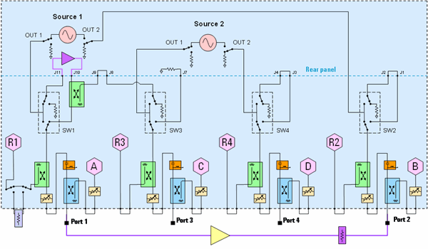

# High-Power Amplifier Measurements with the VNA

* * *

The following is a block diagram of all models of the [PNA-X Opt
423](../Support/Configurations.htm#PNAX). However, all of the models listed
below have the same or fewer components.

The configuration displayed here is used to make high power amplifier
measurements using a preamplifier at the rear panel. The preamplifier can then
be switched (SW1) as needed using the [RF
Configurator.](../S1_Settings/Path_Configurator.htm)

### Damage Levels

Model |  Bridges/Combiners |  Couplers |  Bias-tees  
---|---|---|---  
N5241B, N5242B, N5249B |  +33 dBm |  +43 dBm |  +30 dBm  
N5244B, N5245B |  +27 dBm |  +43 dBm |  +30 dBm  
N5247B |  +27 dBm |  +30 dBm |  +30 dBm  
N5221B, N5222B |  N/A |  +43 dBm |  +30 dBm  
N5224B, N5225B |  N/A |  +43 dBm |  +30 dBm  
N5227B |  N/A |  +30 dBm |  +30 dBm  
  
ALL Switches: Damage level = 1 Watt (+30 dBm) while switching.

ALL Step Attenuators: Damage level = 1 Watt (+30 dBm) while switching.

### Notes

At J11 (rear-panel), max power is 4 dB to 11 dB higher than Source 1 Out at
front panel jumper due to loss of the coupler thru arms, bias-tees, and
cables.

At J10 max power +33 dBm, which is the damage level of the bridge. With +30
dBm into J10, there will be about +15 dBm at R1, assuming 15 dB coupling
factor for the R1 bridge. +15 dBm is the damage level of that receiver.
Therefore, it may be necessary to add attenuation in place of the R1 loop, not
only to protect the receiver, but to bring it out of compression. The 0.1 dB
compression level spec for the R1 receiver is between -3 and -18 dBm,
depending on the frequency and option configuration.

At Test Port 2 (DUT output): With the bias-tees (orange), only +30 dBm is
allowed into the test port. With Opt 222/422 (bias-tees removed), +43 dBm is
allowed. Add appropriate attenuation to not damage other components.

### About the PNA-X Option 222/422

Option 222 and 422 are designed to permit insertion of high power amplifiers
and other signal conditioning equipment to allow high power network
measurements at RF levels up to 20 Watts (+43 dBm) from 10 MHz to 26.5 GHz.
These options supply extended power range attenuators without bias tees. This
is similar to the PNA-X -219 (add extended power range and bias-tees to 2-Port
analyzer) or PNA-X -419 (add extended power range and bias-tees to 4-Port
analyzer) but deletes the bias tees from the test set.

### See Also

  * [High-Gain Amplifier Measurements](High-Gain_Amplifier_Measurements.md)

  * [RF Path Configurator](../S1_Settings/Path_Configurator.md)

  * [IF Path Configurator](../IFAccess/IF_Path_Configuration.md)

  * [High-power measurements using the PNA (5989-1349EN)](http://literature.cdn.Keysight.com/litweb/pdf/5989-1349EN.pdf) Application Note 1408-10 at Keysight.com.

* * *

