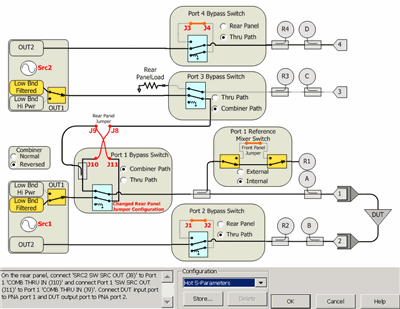
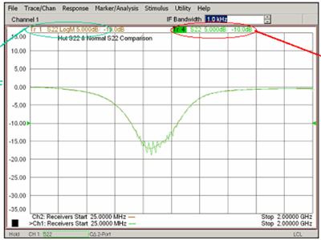

# Hot S22 Measurement

* * *

A 'Hot' S22 measurement is a normal S22 measurement of a power amplifier with
drive power applied to the amplifier input. This situation more closely
resembles the output match characteristics of an amplifier under normal
operating conditions.

Note: Refer also to [Active (Hot)
Parameters](../Applications/Active_Match.htm) for the latest Hot S22
measurement technique.

### Procedure

On the PNA-X:

  1. Press Meas > S-Param > Meas Class..., select Standard, then click OK.

  2. Press Meas > S-Param > S22.

  3. Press Freq, then set the Start and Stop frequencies for the measurement.

  4. Press Freq > Main > Frequency Offset.... Enable Frequency Offset and set the Source(2) frequencies with a positive or negative offset of at least (100 * IFBW). This will be the Hot (Input) signal and must be far enough away from the S-parameter frequencies to avoid interference.

  5. Press Sweep > Sweep Timing > Sweep Mode to STEPPED. 

  6. Press Setup > Internal Hardware > RF Path Config....  

  * For PNA-X models N5241B, N5242B, and N5249B: Under Configuration select Hot S-Parameters. This is necessary because these models have different path loss between J9 to Port1 and J10 to Port1 due to the bridge used as a combiner. The 'Hot' (input) signal coming from Source 2 is routed through the coupled arm of the combiner to port 1 and the DUT input. Configure the rear-panel cables as shown in the above Path Configuration diagram:

  1.      1. On the rear panel, connect 'SRC2 SW SRC OUT (J8)' to Port 1 'COMB THRU IN (J10)'

     2. Connect Port 1 'SW SRC OUT (J11)' to Port 1 'COMB THRU IN (J9)'.

     3. Connect DUT input port to VNA port 1

     4. Connect DUT output port to VNA port 2.

  * For PNA-X models N5244B, N5245B, and N5247B: These models use a splitter as a combiner. Set both the Port 1 and Port 3 Bypass Switch to Combiner Path.

  7. Press Power > Main > Power and Attenuators.... See [Power and Attenuator](../S1_Settings/Power_Level.md#Advanced) for more information.

     1. For Port 2 (DUT output) select at least 10 dB of source attenuation on the Source 1 path.

     2. For Port 1 (DUT input) select the S-parameter port power level.

     3. Click Receiver Attenuator.... Considering the gain of the DUT and the Source 2 input power, select the appropriate attenuation for the B receiver.

  8. Perform a 2-port Calibration.

  9. Press Power, then [Power and Attenuator](../S1_Settings/Power_Level.md#Advanced), and set Port 1 Src2 to ON.

  10. Connect the DUT and measure S22. To ensure the DUT is being driven and the desired power level, perform a Source Power cal for Port 1 Src2.

  11. In the Power and Attenuators dialog, adjust the Port 1 Src 2 power level and notice the change in S22.

The following image shows a Hot S22 measurement of a Hittite HMC452ST89 Power
Amp tuned for 900 MHz.

  * The Red circled measurement is Hot S22.

  * The other is with the Hot signal OFF.

  * If the Hot signal is too close to the measurement signal, ripples appear on the out-of-band region of the trace.

* * *

