# Noise Power Ratio (NPR) Measurement

In this topic:

  * Requirements
  * Measurement Description
  * Physical Setup
  * NPR Measurement Procedure
  * Calibrate Modulation

## Requirements

  * Spectrum Analyzer Option S93090xA/B

  * 2- or 4-Port PNA with ability to connect an external modulated source

  * Supported external sources:

    * E8267D PSG Vector Signal Generator

    * M8190A with E8267D PSG Vector Signal Generator

    * M9383A MCS (wideband vector, 44 GHz, with enhanced phase noise)

    * N5182B MXG RF Vector Signal Generator

    * N5192A and N5194A UXG Vector Adapter

[See All Spectrum Analyzer
Examples](../Applications/Spectrum_Analyzer.htm#Spectrum_Analyzer_Measurement_topics_)

## Measurement Description

NPR measures the nonlinear behavior of an RF microwave amplifier under a
modulated signal stimulus.

In this example, a setup file consisting of a multi-tone signal with a "notch"
is created, uploaded to a signal generator, then fed into the VNA to test the
behavior of the device. The "notch" refers to a small part of the frequency
axis (up to 10% of the frequency span) that is forced to 0 (no signal)
creating a notch in the power spectral density.

NPR is the sum of all intermodulation products across the pass band ratioed
with the sum of all intermodulation products in the notch.

## Physical Setup

The following diagram shows a typical hardware setup using an M8190A with a
E8267D PSG with the signal connected to the VNA rear-panel Port 1 J10 input
connector.

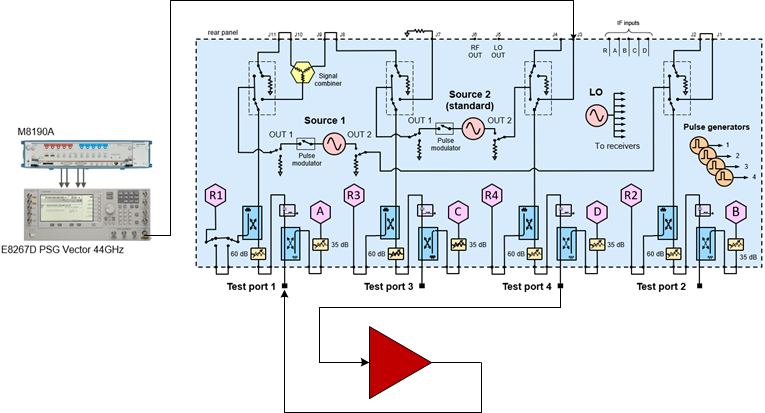

## NPR Measurement Procedure

  1. Connect the equipment as shown above.

  2. On the PNA front panel, press Preset.

  3. On the VNA front panel, press Meas > S-Param > Meas Class....

  4. Select Spectrum Analysis, then either:

     * OK delete the existing measurement, or

     * New Channel to create the measurement in a new channel.

  5. The SA Setup dialog will be displayed.

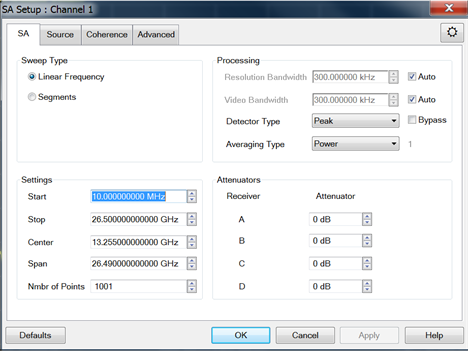

  6. Click on the Source tab. The Source dialog will be displayed.

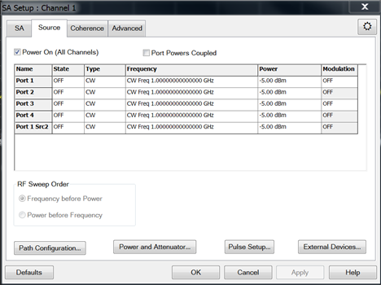

  7. If you need to add an external source, click on the External Devices... button. [Learn more](../System/Configure_an_External_Device.md). After adding an external source, it should be listed in the Name column. The following is an example showing a modulation source called MXG. If the external source does not have modulation capabilities, the IQMod column will be grayed out.  
  
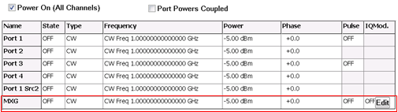

  8. Click on the Path Configuration... button and ensure that the correct RF path is selected according to the Physical Setup then click OK. For this example, the Combiner path for Port 1 is selected since the modulated signal is connected to the rear-panel J10 connector.  
  
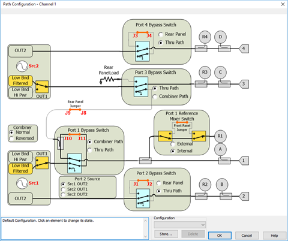

  9. Click in the State field of your external source to change the state to ON.

  10. Click in the Frequency field of your external source to change the frequency.

  11. Click in the Power field of your external source to change the power.

  12. Ensure that the appropriate reference receiver (signal at input of DUT) or test port receiver (signal at output of DUT) is selected based on the Physical Setup.  
  
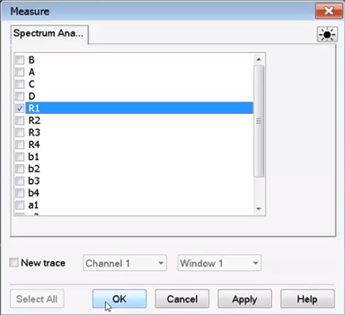

  13. Click in the IQMod column for your external source and select Edit (refer to step 7 dialog example above) to access the Modulation settings dialog.

  14. Click on the Create/Edit Mod File... button to access the Create Modulation dialog.  
  
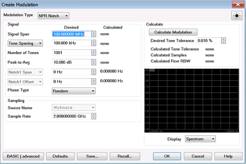

  15. Click on the Source Name drop-down menu to select the source connected to the VNA that will be used to generate the modulated test signal.

  16. Enter the span of the modulation signal in the Signal Span field.

  17. Enter the tone spacing for the multi-tone signal in the Tone Spacing field.

  18. The Number of Tones corresponds to the span and tone spacing. This value will be calculated when you click on the Calculate button.

  19. Enter the span of the notch in the Notch1 Span field. The notch can be up to 10% of the span.

  20. In the Notch Location drop-down menu, select Symmetric to position the notch in the center.

  21. Click on the Calculate button to view the signal.

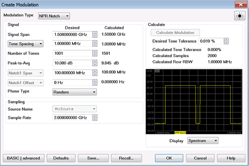

  22. When the signal setup is complete, click on the Save... button to save this setup to a *.mdx file.

  23. Click on the OK button to return to the Modulation settings dialog. The file path and name are displayed in the Modulation Filename field.  
  
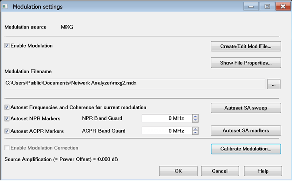

  24. Check the Enable Modulation check box.

  25. The Autoset Frequencies and Coherence for current modulation and Autoset Markers for the current modulation are checked by default. These options automatically adjust the spectrum analyzer frequency and spectrum analyzer markers each time adjustments are made to the modulation settings.

  26. Click on the OK button to close the dialog. The following is an example signal:

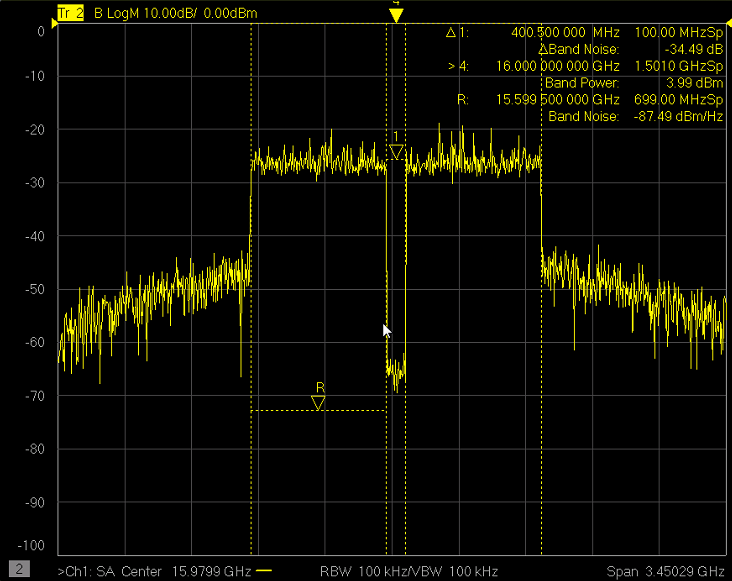

Markers

The ∆ 1 marker displays the notch frequency relative to the center frequency.
In this example the notch is in the center so the frequency is 0 Hz. Also
displayed is the notch marker power level.

The ∆Tone is the difference between the average tone power a the Reference (>
R) marker and the average tone power at the bottom of the notch. This marker
is accessed by pressing Marker -> SA Analysis -> Band Density -> Tone.

The > R marker displays the center frequency (16 GHz) and the signal span (1.5
GHz).

The Band Power displays the total power within the signal span.

The Tone(1.40 GHz) displays the average tone power across the 1.5 GHz signal
span minus the average tone power across the notch (1.5 GHz - 100 MHz = 1.4
GHz).

To learn more about these markers, refer to [SA Analysis
Markers](../S4_Collect/Markers.htm#Spectrum_Analyzer_Marker_Search).

  27. To view the signal at the output of the DUT, add a new trace and select the B test port receiver since the output of the DUT is connected to port 2.

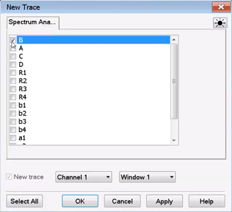

  28. The following is an example. The blue trace is the signal at the output of the DUT.  
  
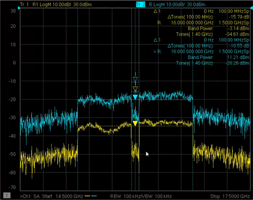

## Calibrate Modulation

The Modulation Cal procedure optimizes the signal across the pass band and the
depth of the notch.

  1. Click on the SA Setup... button to open the SA Setup dialog then select the Source tab.

  2. Click in the IQMod column for your external source and select Edit to access the Modulation settings dialog.  
  

  3. Click on the Calibrate Modulation... button. The Modulation Cal - Setup dialog is displayed.

  4. Select Power to calibrate power across the entire pass band.

  5. Select Flatness to calibrate flatness across the entire pass band.

  6. Select NPR Notch to create as deep a notch as possible.

  7. Under Calibrate At, select Rcvr R1 for Power Cal, Flatness Cal, and NPR Notch Cal. This will perform a calibration at the input of the DUT.

  8. The default values for Max Nmbr Iterations and Desired Tolerance will be used.

  9. Click Next. The following dialog is displayed.

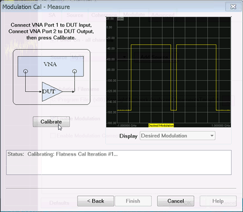

  10. Click Calibrate to begin the calibration. When finished, the corrected modulated signal is displayed.

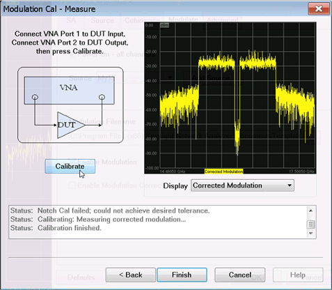

  11. Click on the Finish button then click on the Save & Exit button to save the file. If one or more of the default tolerance values could not be achieved, a warning message is displayed. You have the option to change the tolerance values and re-calibrate or save the current calibration.  
  
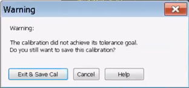

  12. In the Modulation Cal - Measure dialog, note that the failed calibration is indicated in the text box.  
  
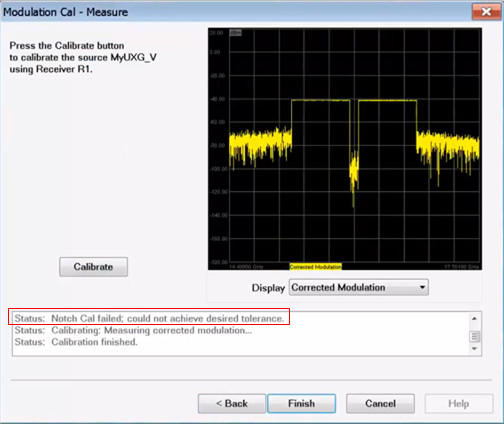

  13. In the Modulation settings dialog, Enable Modulation Correction is automatically checked if the user exits the wizard with Exit & Save Cal. 

  14. Click OK.

  15. The following shows an optimized input signal.  
  
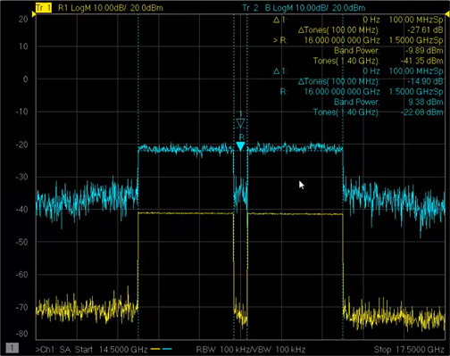

We can now see the Power Amplifier DUT output NPR (blue trace -14.90 dB) and
still monitor the NPR at the DUT input (yellow trace -27.61 dB here).

