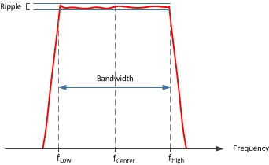

# Filter Measurements

The main filter measurements discussed in this topic include:

  * Measurements
  *     * Bandwidth
    * Center Frequency
    * Q Factor
    * Filter Loss (Insertion Loss)
    * Retrieving Filter Statistics
  * Ripple
  *     * Retrieving Peak to Peak Ripple
  * Smoothing
  *     * Performing a Smoothing Function
  * Related SCPI and COM Remote Commands

## Measurements

### Bandwidth

Marker search functions automatically determine the bandwidth of a band-pass
filter by placing a marker on the maximum level (marker 1), a marker on the
lower frequency (marker 2), and a marker on the higher frequency (marker 3).
The higher and lower frequencies are determined by specifying a target
bandwidth level. The default target bandwidth level is -3 dB which means that
the bandwidth of a band-pass filter is determined by measuring the higher and
lower frequencies at -3 dB below the peak.

To find the bandwidth of a notch filter, a positive value would be entered for
the target bandwidth level (for example, 3 dB). For notch filters, the marker
search functions place a marker on the minimum level (marker 1), a marker on
the lower frequency (marker 2), and a marker on the higher frequency (marker
3).

### Center Frequency

In addition to being used to determine the bandwidth, markers 2 and 3 are used
to determine the center frequency of a band-pass or notch filter by
calculating the mathematical midpoint between them as shown in the diagram
above.

### Q Factor

After determining the bandwidth and center frequency using the marker search
functions, the VNA also calculates the Q factor as the ratio of Center
Frequency to Bandwidth (Center Frequency / Bandwidth).

The VNA can measure very high Q factors limited only by the IF bandwidth and
the number of sampling points. You must ensure that a sufficient number of
sampling points are utilized for accurate results.

### Filter Loss (Insertion Loss)

The filter loss is the loss caused by the insertion of the filter into the
transmission line. The loss is defined as follows:

Marker search functions retrieve the filter loss as the Y-axis value of marker
4. This is the loss of the filter at its center frequency.

### Retrieving Filter Statistics

The following procedure retrieves filter bandwidth, center frequency, loss,
and Q factor.

  1. Press Search > Bandwidth & Notch > BW Level.

  2. Enter the target bandwidth level (default is -3 dB).

Note: To find the bandwidth of a notch filter, enter a positive value for the
target bandwidth level.

  4. Press Search > Bandwidth & Notch > Bandwidth Search to retrieve filter statistics.

## Ripple

Ripple refers to the amplitude deviation of the band-pass filter, which is
also referred to as filter flatness. The VNA's trace statistics functions are
used to find the peak to peak ripple in the band-pass as shown in Retrieving
Peak to Peak Ripple.

### Retrieving Peak to Peak Ripple

The following procedure sets up and retrieves the ripple of the filter.

  1. Press Math > Analysis > Statistics....

  2. In the Trace Statistics dialog, select Statistics - Mean, Standard Deviation, Peak to Peak.

  3. In the pull-down menu, select a User number to assign a range.

  4. Enter the Start and Stop frequencies for the ripple measurement. This should be the bandwidth of the band-pass filter.

  5. Click OK to retrieve the peak to peak ripple of the filter.

## Smoothing

The VNA has a smoothing function that applies an average smoothing on a trace.
The smoothing function is defined as follows:

where 2m + 1 is called the smoothing aperture measured in points.

The smoothing function is also provided as a percentage of the span and then
converted to smoothing points as follows:

When applied, each point becomes an average of the surrounding points.

### Performing a Smoothing Function

  1. Press Avg BW > Smoothing > Smoothing ON.

  2. If entering a percentage of the span, press Avg BW > Smoothing > Smooth Percent which will change the number of Smoothing Points appropriately.

  3. If entering smoothing points, press Avg BW > Smoothing > Smooth Points which will change the Smoothing Percent Span appropriately.

## Related SCPI and COM Remote Commands

Description | SCPI | COM  
---|---|---  
Determines the filter bandwidth -3 dB (default) below the band-pass filter peak | [CALCulate:MEASure:MARKer:BWIDth:THReshold](../Programming/GP-IB_Command_Finder/Calculate/MeasureMARKer.md#CALCulate:MEASure:MARKer:BWIDth:THReshold) | [BandwidthTarget](../Programming/COM_Reference/Properties/Bandwidth_Target_Property.md)  
Searches measurement data using current Bandwidth Target to determine the bandwidth | [CALCulate:MEASure:MARKer:BWIDth[:STATe]](../Programming/GP-IB_Command_Finder/Calculate/MeasureMARKer.md#CALCulate:MEASure:MARKer:BWIDth:STATe) | [SearchFilterBandwidth](../Programming/COM_Reference/Methods/Search_Filter_Bandwidth_Method.md)  
Retrieves the filter bandwidth | [CALCulate:MEASure:MARKer:BWIDth:DATA?](../Programming/GP-IB_Command_Finder/Calculate/MeasureMARKer.md#CALCulate:MEASure:MARKer:BWIDth:DATA) | [FilterBW](../Programming/COM_Reference/Properties/Filter_BW_Property.md)  
Retrieves the filter center frequency | [CALCulate:MEASure:MARKer:BWIDth:DATA?](../Programming/GP-IB_Command_Finder/Calculate/MeasureMARKer.md#CALCulate:MEASure:MARKer:BWIDth:DATA) | [FilterCF](../Programming/COM_Reference/Properties/Filter_CF_Property.md)  
Retrieves the filter Q factor | [CALCulate:MEASure:MARKer:BWIDth:DATA?](../Programming/GP-IB_Command_Finder/Calculate/MeasureMARKer.md#CALCulate:MEASure:MARKer:BWIDth:DATA) | [FilterQ](../Programming/COM_Reference/Properties/Filter_Q_Property.md)  
Retrieves the filter loss | [CALCulate:MEASure:MARKer:BWIDth:DATA?](../Programming/GP-IB_Command_Finder/Calculate/MeasureMARKer.md#CALCulate:MEASure:MARKer:BWIDth:DATA) | [FilterLoss](../Programming/COM_Reference/Properties/Filter_Loss_Property.md)  
Retrieves all filter statistics | [CALCulate:MEASure:MARKer:BWIDth:DATA?](../Programming/GP-IB_Command_Finder/Calculate/MeasureMARKer.md#CALCulate:MEASure:MARKer:BWIDth:DATA) | [GetFilterStatistics](../Programming/COM_Reference/Methods/Get_Filter_Statistics_Method.md)  
Continually tracks the filter bandwidth | [CALCulate:MEASure:MARKer:FUNCtion:TRACking](../Programming/GP-IB_Command_Finder/Calculate/MeasureMARKer.md#CALCulate:MEASure:MARKer:FUNCtion:TRACking) | [BandwidthTracking](../Programming/COM_Reference/Properties/Bandwidth_Tracking_Property.md)  
|  |   
Enables/disables trace statistics | [CALCulate:MEASure:FUNCtion:STATistics[:STATe]](../Programming/GP-IB_Command_Finder/Calculate/MeasureFUNCtion.md#CALCulate:MEASure:FUNCtion:STATistics:STATe) | [ShowStatistics](../Programming/COM_Reference/Properties/Show_Statistics_Property.md)  
Sets the start frequency for the measurement | [CALCulate:MEASure:FUNCtion:DOMain:USER:STARt](../Programming/GP-IB_Command_Finder/Calculate/MeasureFUNCtion.md#CALCulate:MEASure:FUNCtion:DOMain:USER:STARt) | [UserRangeMin](../Programming/COM_Reference/Properties/User_Range_Min_Property.md)  
Sets the stop frequency for the measurement | [CALCulate:MEASure:FUNCtion:DOMain:USER:STOP](../Programming/GP-IB_Command_Finder/Calculate/MeasureFUNCtion.md#CALCulate:MEASure:FUNCtion:DOMain:USER:STOP) | [UserRangeMax](../Programming/COM_Reference/Properties/User_Range_Max_Property.md)  
Sets the range used to calculate trace statistics | [CALCulate:MEASure:FUNCtion:DOMain:USER[:RANGe]](../Programming/GP-IB_Command_Finder/Calculate/MeasureFUNCtion.md#CALCulate:MEASure:FUNCtion:DOMain:USER:RANGe) | [StatisticsRange](../Programming/COM_Reference/Properties/Statistics_Range_Property.md)  
Sets the statistic type (peak to peak) | [CALCulate:MEASure:FUNCtion:TYPE](../Programming/GP-IB_Command_Finder/Calculate/MeasureFUNCtion.md#CALCulate:MEASure:FUNCtion:TYPE) | None  
Retrieves the peak to peak value | [CALCulate:MEASure:FUNCtion:DATA?](../Programming/GP-IB_Command_Finder/Calculate/MeasureFUNCtion.md#CALCulate:MEASure:FUNCtion:DATA) | [PeakToPeak](../Programming/COM_Reference/Properties/PeakToPeak_Property.md)  
|  |   
Turns data smoothing on/off | [CALCulate:MEASure:SMOothing[:STATe]](../Programming/GP-IB_Command_Finder/Calculate/MeasureSMOothing.md#CALCulate:MEASure:SMOothing:STATe) | [Smoothing](../Programming/COM_Reference/Properties/Smoothing_Property.md)  
Sets smoothing as a percentage of span | [CALCulate:](../Programming/GP-IB_Command_Finder/Calculate/MeasureSMOothing.md#CALCulate:MEASure:SMOothing:APERture)[MEASure:SMOothing:APERture](../Programming/GP-IB_Command_Finder/Calculate/Smoothing_Calc.md#css) | [SmoothingAperture](../Programming/COM_Reference/Properties/Smoothing_Aperture_Property.md)  
Sets the number of adjacent data points to average | [CALCulate:](../Programming/GP-IB_Command_Finder/Calculate/MeasureSMOothing.md#CALCulate:MEASure:SMOothing:POINts)[MEASureSMOothing:POINts](../Programming/GP-IB_Command_Finder/Calculate/Smoothing_Calc.md#css) | None

