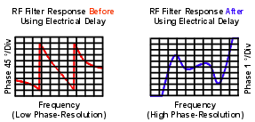
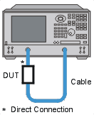

# Deviation from Linear Phase

* * *

Deviation from linear phase is a measure of phase distortion. The electrical
delay feature of the analyzer is used to remove the linear portion of the
phase shift from the measurement. This results in a high-resolution display of
the non-linear portion of the phase shift (deviation from linear phase).

  * [What Is Linear Phase Shift?](Phase_Devi.md#shift)

  * [What Is Deviation from Linear Phase?](Phase_Devi.md#devi)

  * [Why Measure Deviation from Linear Phase?](Phase_Devi.md#why)

  * [Using Electrical Delay](Phase_Devi.md#edelay)

  * [Accuracy Considerations](Phase_Devi.md#accy)

See also [Comparing the Analyzer Delay
Functions](Comparing_the_PNA_Delay_Functions.htm)

[See other Tutorials](Tutorials1.md)

What Is Linear Phase Shift?

Phase shift occurs because the wavelengths that occupy the electrical length
of the device get shorter as the frequency of the incident signal increases.
Linear phase-shift occurs when the phase response of a device is linearly
proportional to frequency. Displayed on the analyzer, the phase-versus-
frequency measurement trace of this ideal linear phase shift is a straight
line. The slope is proportional to the electrical length of the device. Linear
phase shift is necessary (along with a flat magnitude response) for
distortionless transmission of signals.

What Is Deviation from Linear Phase?

In actual practice, many electrical or electronic devices will delay some
frequencies more than others, creating non-linear phase-shift (distortion in
signals consisting of multiple-frequency components). Measuring deviation from
linear phase is a way to quantify this non-linear phase shift.

Since it is only the deviation from linear phase which causes phase
distortion, it is desirable to remove the linear portion of the phase response
from the measurement. This can be accomplished by using the electrical delay
feature of the analyzer to mathematically cancel the electrical length of the
device under test. What remains is the deviation from linear phase, or phase
distortion.

Why Measure Deviation from Linear Phase?

The deviation from linear phase measurement accomplishes the following:

  * Presents data in units of phase rather than units of seconds (group delay). For devices that pass modulated signals, units of phase may be most practical.

  * Provides a less noisy measurement than a [group delay](Group_Delay6_5.md) measurement.

Using Electrical Delay

The electrical delay feature is the electronic version of the mechanical "line
stretcher" of earlier analyzers. This feature does the following:

  * Simulates a variable-length lossless transmission line, which is effectively added to or removed from the reference signal path.

  * Compensates for the electrical length of the device under test.

  * Flattens the measurement trace on the analyzer's display. This allows the trace to be viewed at high resolution in order to see the details of the phase nonlinearity.

  * Provides a convenient method to view the deviation from linear phase of the device under test. See the following graphic.

[Learn how to set Electrical Delay.](../S2_Opt/Phase_Accy.md#ed)

Accuracy Considerations

The frequency response of the test setup is the dominant error in a deviation
from linear phase measurement. To reduce this error, perform a 2-port
measurement calibration.

How to Measure Deviation from Linear Phase:

  1. Preset the analyzer.

  2. If your device under test is an amplifier, it may be necessary to adjust the analyzer's source power:

     * Set the analyzer's source power to be in the linear region of the amplifier's output response (typically 10-dB below the 1-dB compression point).

     * Select an external attenuator (if needed) so the amplifier's output power will be sufficiently attenuated to avoid causing receiver compression or damage to the analyzer's port 2.

  3. Connect the device under test as shown in the following graphic.

  4. Select an S21 measurement.

  5. Select the settings for your device under test, including the following:

     * [Format](../S1_Settings/Data_Format.md): phase

     * [Scale](../S1_Settings/Scale.md): autoscale

  6. Remove the device and perform a calibration.

  7. Reconnect the device.

  8. Scale the displayed measurement for optimum viewing.

  9. [Create a marker](../S4_Collect/Markers.md#Activating) in the middle of the trace.

  10. Press Marker > Marker -> Functions > Marker -> Delay to invoke the [Marker to Electrical Delay](../S4_Collect/Markers.md#FunctionDiag) function. This flattens the phase trace.

  11. If desired, on the Scale menu, click [Electrical Delay](../S2_Opt/Phase_Accy.md#ed) to fine-tune the flatness of the phase trace.

  12. Use the markers to measure the maximum peak-to-peak deviation from linear phase.

  13. Print the data or save it to a disk.

* * *

