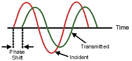
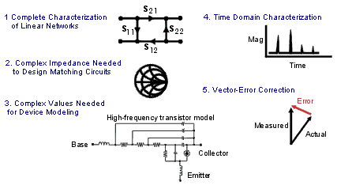
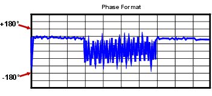

# Phase Measurements

* * *

Knowledge of both magnitude and phase characteristics is needed for successful
higher-level component integration.

  * [What are Phase Measurements?](Phase_Meas.md#what)

  * [Why Measure Phase?](Phase_Meas.md#why)

  * [Using the Analyzer's Phase Format](Phase_Meas.md#form)

  * [Types of Phase Measurements](Phase_Meas.md#types)

[See other Tutorials](Tutorials1.md)

What are Phase Measurements?

Phase measurements are made using S-parameters, just like amplitude
measurements. A phase measurement is a relative (ratio) measurement and not an
absolute measurement. Phase measurements compare the phase of the signal going
into a device (the incident signal) to the phase of the device's response
signal. The response signal can be either reflected or transmitted. Assuming
an accurate calibration has been performed, the difference in phase between
the two signals (known as phase shift) is a result of the electrical
characteristics of the device under test.

The following graphic shows the phase shift (in time or degrees) between an
incident signal and a transmitted signal (as might be seen on an oscilloscope
display).

Why Measure Phase?

Measuring phase is a critical element of network analysis. The following
graphic lists five reasons for measuring both magnitude and phase.

When used in communications systems to pass signals, components or circuits
must not cause excessive signal distortion. This distortion can be:

  * Linear, where flat magnitude and linear phase shift versus frequency is not maintained over the bandwidth of interest.

  * Nonlinear, such as AM-to-PM conversion.

It is important to measure how reflective a component or circuit is, to ensure
that it transmits or absorbs energy efficiently. Measuring the complex
impedance of an antenna is a good example.

Using the Analyzer's Phase Format

The analyzer's phase format displays a phase-versus-frequency or phase-versus-
power measurement. The analyzer does not display more than ±180 degrees phase
difference between the reference and test signals. As the phase value varies
between +180 degrees and -180 degrees, the analyzer display creates the
sawtooth pattern as shown in the following graphic.

The sawtooth pattern does not always reach +180 degrees and -180 degrees. This
is because the measurement is made at discrete frequencies, and the data point
at +180 degrees and -180 degrees may not be measured for the selected sweep.

Types of Phase Measurements

  * [Complex impedance](Comp_Imped.md) data is information such as resistance, reactance, phase, and magnitude that can be determined from an S11 or S22 measurement. Complex impedance data can be viewed using either the Smith Chart format or the Polar format.

  * [AM-to-PM conversion](AM-PM.md) is a measure of the amount of undesired phase deviation (PM) that is caused by amplitude variations (AM) of the system. AM-to-PM conversion is usually defined as the change in output phase for a 1-dB increment in the input power to an amplifier (i.e. at the 1 dB gain compression point). This is expressed in degrees-per-dB (°/dB).

  * [Deviation from linear phase](Phase_Devi.md) is a measure of phase distortion caused by a device. Ideally, the phase shift through a device is a linear function of frequency. The amount of variation from this theoretical phase shift is known as its deviation from linear phase (also called phase linearity).

  * [Group delay](Group_Delay6_5.md) is another way to look at phase distortion caused by a device. Group delay is a measure of transit time through a device at a particular frequency. The analyzer computes group delay from the derivative of the measured phase response.

Deviation from Linear Phase Versus Group Delay

Although deviation from linear phase and group delay are similar measurements,
they each have their purpose.

The following are the advantages of deviation from linear phase measurements:

  * Less noisy than group delay.

  * Able to characterize devices that pass phase modulated signals, and show units of phase rather than units of seconds.

The following are the advantages of group delay measurements:

  * More easily interpreted indication of phase distortion than deviation from linear phase.

  * Able to most accurately characterize a device under test. This is because in determining group delay, the analyzer calculates the slope of the phase ripple, which is dependent on the number of ripples which occur per unit of frequency. Comparing two phase responses with equal peak-to-peak phase ripple, the response with the larger phase slope results in:

  *     * More group delay variation.

    * More signal distortion.

See also [Comparing the Analyzer Delay
Functions.](Comparing_the_PNA_Delay_Functions.htm)

