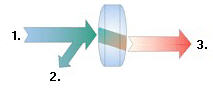
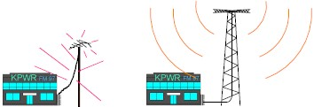
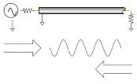
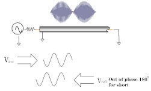
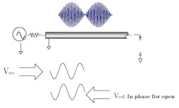
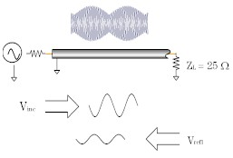
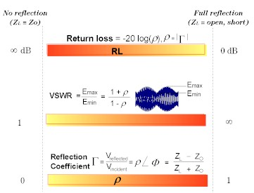

# Reflection Measurements

* * *

Reflection measurements are an important part of network analysis.

  * [What are Reflection Measurements?](Reflection_Measurements.md#what)

  * [Why Make Reflection Measurements?](Reflection_Measurements.md#why)

  * [Expressing Reflected Waves](Reflection_Measurements.md#exp)

  *     * [Return Loss](Reflection_Measurements.md#rl)

    * [VSWR](Reflection_Measurements.md#vswr)

    * [Reflection Coefficient](Reflection_Measurements.md#rc)

    * [Impedance](Reflection_Measurements.md#z)

    * [Summary of Expressions](Reflection_Measurements.md#sum)

[See other Tutorials](Tutorials1.md)

What are Reflection Measurements?

To understand reflection measurements, it is helpful to think of traveling
waves along a transmission line in terms of a lightwave analogy. We can
imagine incident light striking some optical component like a clear lens. Some
of the light is reflected off the surface of the lens, but most of the light
continues on through the lens. If the lens had mirrored surfaces, then most of
the light would be reflected and little or none would be transmitted.

1. Incident 2. Reflected 3. Transmitted

With RF energy, reflections occur when the impedance of two mated devices are
not the same. A reflection measurement is the ratio of the reflected signal to
the incident signal. Network analyzers measure the incident wave with the R
(for reference) channel and the reflected wave with the A channel. Therefore,
reflection is often shown as the ratio of A over R (A/R). We can completely
quantify the reflection characteristics of our device under test (DUT) with
the amplitude and phase information available at both the A and R channel. In
S-parameter terminology, S11 is a reflection measurement of port1 of the
device (the input port); S22 is a reflection measurement of the port 2 (the
output port)

Why Make Reflection Measurements?

One reason we make reflection measurements to assure efficient transfer of RF
power. We do this because:

  1. RF energy is not cheap. When energy is reflected, that means less energy is transmitted to where it is intended to go.

  2. If the reflected energy is large, it can damage components, like amplifiers.

For example, in the following graphic, the radio station on the left is not
operating at peak efficiency. The amplifier impedance is not the same as the
transmission line, and the transmission line impedance is not the same as the
antenna. Both of these conditions cause high reflected power. This condition
results in less transmitted power, and the high reflected power could damage
the amplifier.

The radio station on the right installed properly "matched" transmission line
and antenna. Very little of the transmitted signal is reflected, resulting in
increased broadcast power, more listeners, more advertising revenue, and more
profit. The amplifier, transmission, and antenna all need to be measured to
ensure that reflected power is minimized.

Expressing Reflected Waves

After making a reflection measurement, the reflection data can be expressed in
a number of ways, depending on what you are trying to learn. The various
expressions are all calculated by the analyzer from the same reflection
measurement data. Each method of expressing reflection data can be graphically
displayed in one or more formats. For more information, see display formats.

### Return Loss

The easiest way to convey reflection data is return loss. Return loss is
expressed in dB, and is a scalar (amplitude only) quantity. Return loss can be
thought of as the absolute value or dB that the reflected signal is below the
incident signal. Return loss varies between infinity for a perfect impedance
match and 0 dB for an open or short circuit, or a lossless reactance. For
example, using the log magnitude format on the analyzer, the measured
reflection value on the screen may be -18dB. The minus sign is ignored when
expressing return loss, so the component is said to have 18dB of return loss.

### VSWR

Two waves traveling in opposite directions on the same transmission line cause
a "standing wave". This condition can be measured in terms of the voltage
standing wave ratio (VSWR or SWR for short). VSWR is defined as the maximum
reflected voltage over the minimum reflected voltage at a given frequency.
VSWR is a scalar (amplitude only) quantity. VSWR varies between one for a
perfect match, and infinity for an open or short circuit or lossless
reactance.

### Reflection Coefficient

Another way of expressing reflection measurements is reflection coefficient
gamma (G). Gamma includes both magnitude and phase.

The magnitude portion of gamma is called rho (r). Reflection coefficient is
the ratio of the reflected signal voltage to the incident signal voltage. The
range of possible values for r is between zero and one. A transmission line
terminated in its characteristic impedance will have all energy transferred to
the load; zero energy will be reflected and r = 0. When a transmission line
terminated in a short or open circuit, all energy is reflected and r = 1. The
value of rho is unitless.

Now for the phase information. At high frequencies, where the wavelength of
the signal is smaller than the length of conductors, reflections are best
thought of as waves moving in the opposite direction of the incident waves.
The incident and reflected waves combine to produce a single "standing" wave
with voltage that varies with position along the transmission line.

When a transmission line is terminated in its characteristic impedance (Zo)
there is no reflected signal. All of the incident signal is transferred to the
load, as shown in the following graphic. There is energy flowing in one
direction along the transmission line.

|   |  Zo  
---|---|---  
Incident  
Voltage |  Reflected  
Voltage = 0  
|  (All the incident power is absorbed in the load)  
  
When a transmission line is terminated in a short circuit termination, all of
the energy is reflected back to the source. The reflected wave is equal in
magnitude to the incident wave (r = 1). The voltage across any short circuit
is zero volts. Therefore, the voltage of the reflected wave will be 180
degrees out of phase with the incident wave, canceling the voltage at the
load.

When a transmission line is terminated in an open circuit termination, all of
the energy is reflected back to the source. The reflected wave is equal in
magnitude to the incident wave (r = 1). However, no current can flow in an
open circuit. Therefore, the voltage of the reflected wave will be in phase
with the voltage of the incident wave.

When a transmission line is terminated in a 25 ohm resistor, some but not all
of the incident energy will be absorbed, and some will be reflected back
towards the source. The reflected wave will have an amplitude 1/3 that of the
incident wave and the voltage of the two waves will be out of phase by 180
degrees at the load. The phase relationship will change as a function of
distance along the transmission line from the load. The valleys of the
standing wave pattern will no longer go to zero, and the peaks will be less
than that of the open / short circuit.

For more information, see [Phase Measurements.](Phase_Meas.md)

### Impedance

Impedance is another way of expressing reflection data. For more information
on Impedance, see [Smith Charts](../S1_Settings/Data_Format.md#Smith_Chart).

Summary of the Expressions of Reflection Measurements:

