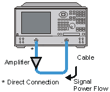

# Reverse Isolation

* * *

Reverse isolation is a measure of amplifier reverse transmission response-
from output to input.

  * [What is Reverse Isolation](Rev_Isol.md#what)

  * [Why Measure Reverse Isolation?](Rev_Isol.md#why)

  * [Accuracy Considerations](Rev_Isol.md#ACC)

  * [How to Measure Reverse Isolation](Rev_Isol.md#how)

[See other Tutorials](Tutorials1.md)

What is Reverse Isolation?

Reverse isolation is a measure of how well a signal applied to the device
output is "isolated" from its input.

The measurement of reverse isolation is similar to that of forward gain,
except:

  * The stimulus signal is applied to the amplifier's output port.

  * The response is measured at the amplifier's input port.

The equivalent S-parameter is S12.

Why Measure Reverse Isolation?

An ideal amplifier would have infinite reverse isolation-no signal would be
transmitted from the output back to the input. However, reflected signals can
pass through the amplifier in the reverse direction. This unwanted reverse
transmission can cause the reflected signals to interfere with the desired
fundamental signal flowing in the forward direction. Therefore, reverse
isolation is important to quantify.

Accuracy Considerations

Since amplifiers often exhibit high loss in the reverse direction, generally
there is no need for any attenuation that may have been used to protect the
port 2 receiver during forward transmission measurements. Removing the
attenuation will:

  * Increase the dynamic range, resulting in improved measurement accuracy.

  * Require a new calibration for maximum accuracy.

The RF source power can be increased to provide more dynamic range and
accuracy.

Note: With the attenuation removed and the RF source power increased, a
forward sweep could damage the analyzer's port 2 receiver. Do not perform a
forward sweep or use 2-port calibration unless the forward power is set low
enough to avoid causing port 2 receiver compression or damage.

If the isolation of the amplifier under test is very large, the transmitted
signal level may be near the noise floor or crosstalk level of the receiver.
To lower the noise floor:

  * Use or increase measurement averages.

  * Reduce the IF bandwidth of the analyzer.

Note: Reducing IF bandwidth or using averaging improves measurement dynamic
range and accuracy, at the expense of reduced measurement speed.

  * When crosstalk levels affect the measurement accuracy, reduce the crosstalk error term by performing a response and isolation calibration. When performing the isolation part of the calibration it is important to use the same average factor and IF bandwidth during the calibration and measurement.

  * The frequency response of the test setup is the dominant error in a reverse isolation measurement. Performing a thru-response measurement calibration significantly reduces this error. This calibration can be done as part of the response and isolation calibration.

  * The amplifier may respond very differently at various temperatures. The tests should be done when the amplifier is at the desired operating temperature.

How to Measure Reverse Isolation

  1. Connect the amplifier as shown in the following graphic.

  2. Preset the analyzer.

  3. Select an S12 measurement.

  4. Select the settings for your amplifier under test.

  5. Remove the amplifier and perform a thru-response calibration or a response and isolation calibration.

  6. Scale the displayed measurement for optimum viewing and use a marker to measure the reverse isolation at a desired frequency.

  7. Print or save the data to a disk.

