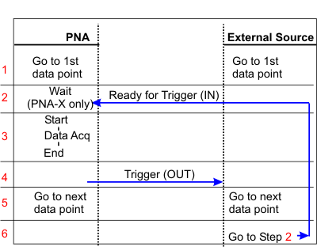

# Synchronize VNA/PNA-X with an External Source(s)

* * *

The VNA External Source Control feature can be used to automatically control
external sources. However, this feature requires certain VNA options. [Learn
more.](../System/Configure_an_External_Device.htm)  
---  
  
Many VNA measurements require the use of at least two sources. If your VNA has
only one internal source, an external source is required. For example, when
measuring the insertion loss of a mixer, the LO must be swept at the same time
as the RF input. This requires the VNA and external source to be synchronized.

The following procedure shows how to automatically synchronize the VNA/PNA-X
with an Keysight external sources.

## Hardware configuration

  * Connect the VNA and External Source(s) Time Base ([VNA/PNA-X 10 MHz OUT](../Rear_Panel/XRtour.md#10M) to External Source 10 MHz IN)

Connect the [AUX Trigger I/O
connectors](../Rear_Panel/XRtour.htm#ExternalTrig) as follows (for two
sources):

  * VNA/PNA-X AUX Trig-1 IN to External Source-1 Trigger OUT

  * VNA/PNA-X AUX Trig-1 OUT to External Source-1 Trigger IN

  * VNA/PNA-X AUX Trig-2 IN to External Source-2 Trigger OUT

  * VNA/PNA-X AUX Trig-2 OUT to External Source-2 Trigger IN

[Learn more about the AUX Trigger
capabilities.](../S1_Settings/External_Triggering.htm)

* * *

### VNA/PNA-X Settings

  * Refer to [External Source Configuration](../System/Configure_an_External_Source.md)

* * *

### What is Happening?

The following is a flow diagram showing the handshake / synchronization
process between the VNA/PNA-X and an External Source.

### Text Description

1. VNA/PNA-X loads frequency points and source power information onto the external source(s).

2. A trigger signal from the source starts the first data point of the measurement.

3. VNA/PNA-X data acquisition (measurement) starts, and then stops AFTER the first data point acquisition.

4. The VNA/PNA-X sends a trigger signal out to the source telling it to move to the next frequency data point.

5. The external source and VNA/PNA-X move to the next data point. The source usually takes longer than the VNA.

6. The source sends the Ready for Trigger signal to the VNA/PNA-X for next data acquisition.

7. Back to step 4 until last data point.

* * *

